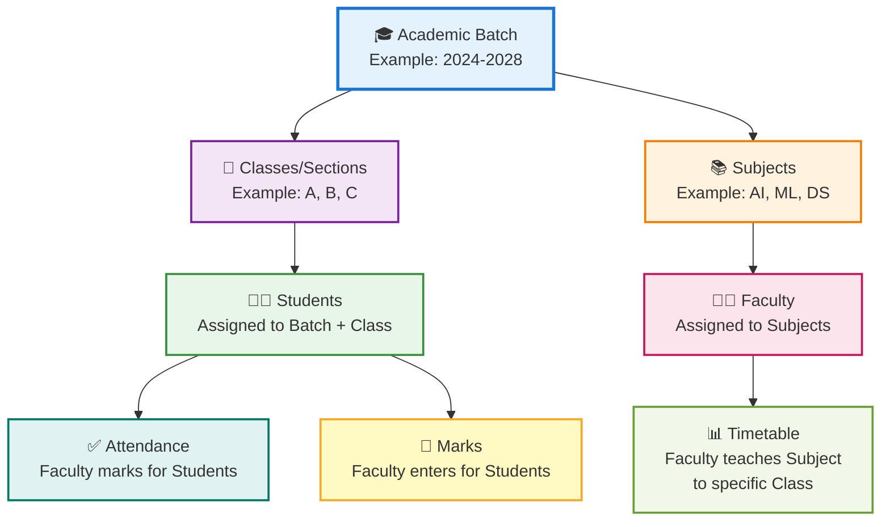
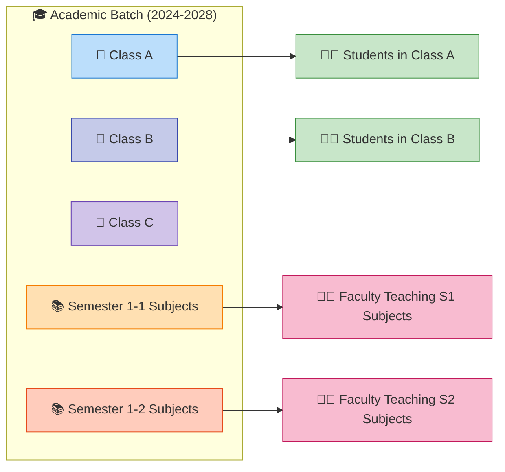
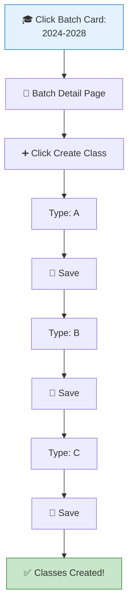
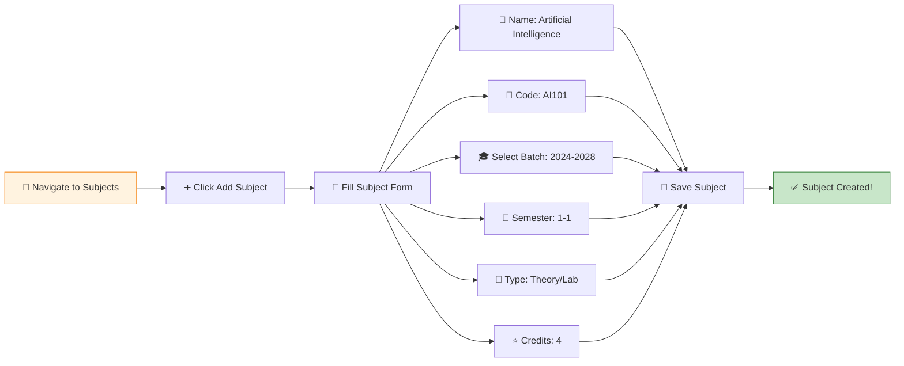
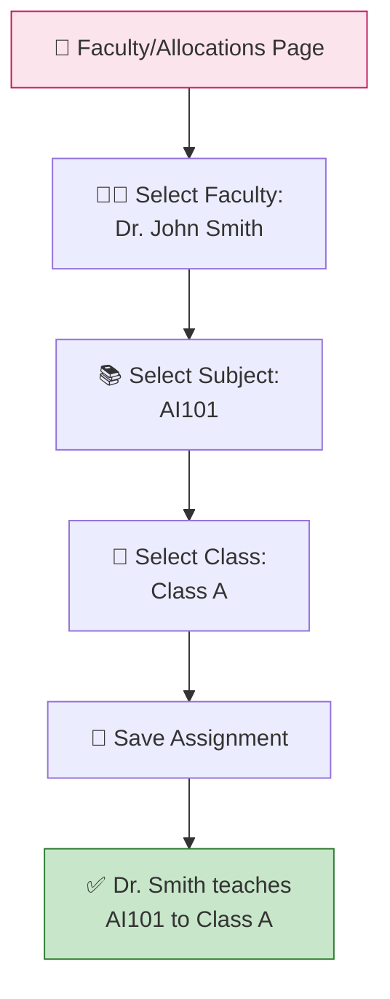
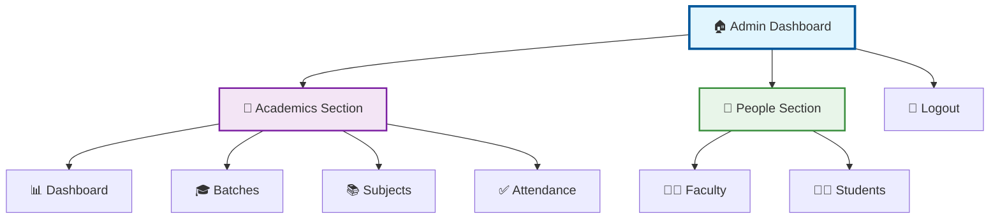
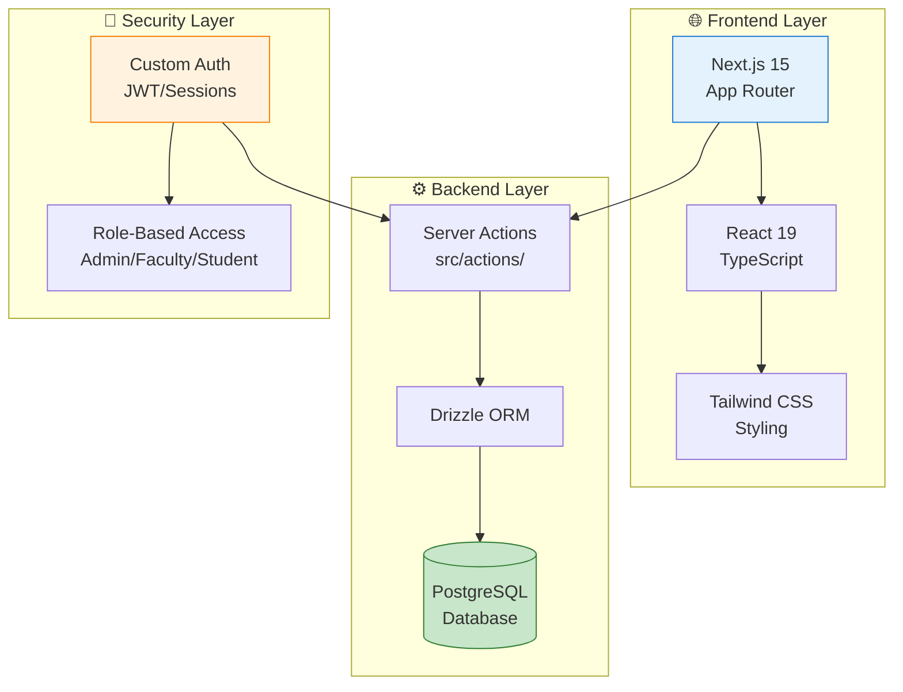
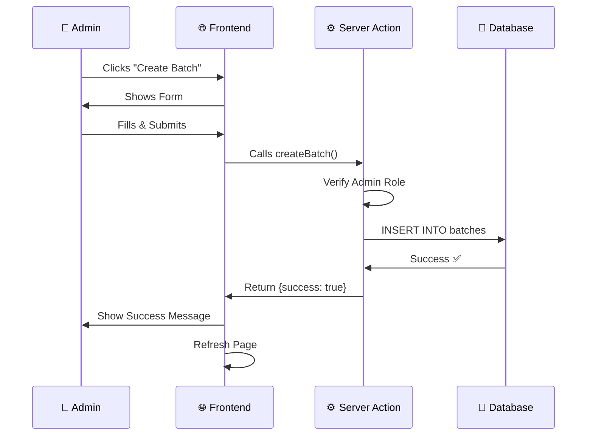
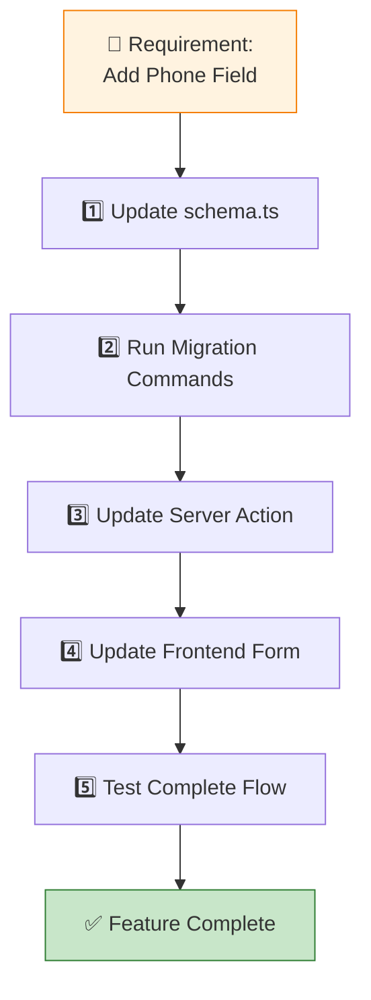

```mermaid
flowchart LR
    START([👤 Admin Login]) --> DASH[📊 Dashboard]
    DASH --> NAV[🧭 Click Academics > Batches]
    NAV --> FORM[📝 Fill Batch Form]
    FORM --> NAME[Enter Name: 2024-2028]
    NAME --> DATES[Select Start & End Dates]
    DATES --> ACTIVE[✅ Check Active]
    ACTIVE --> SAVE[💾 Click Save]
    SAVE --> SUCCESS[✅ Batch Created!]
    SUCCESS --> NEXT[➡️ Click on the Batch Card]
    
    style START fill:#e1f5fe,stroke:#01579b
    style SUCCESS fill:#c8e6c9,stroke:#2e7d32
    style SAVE fill:#fff9c4,stroke:#f9a825
```

# 🎓 SVR Department of AI - Complete Administrator Guide

> **Purpose**: This guide helps Administrators manage the academic system and provides Developers with technical details for maintenance.

---

## 📑 Table of Contents
1. [Quick Start for Admins](#-part-1-administrator-quick-start)
2. [Visual System Overview](#-visual-system-hierarchy)
3. [Step-by-Step Setup Guide](#-complete-setup-workflow)
4. [Feature Reference](#-complete-feature-reference)
5. [Developer & Architecture](#-part-2-developer--architecture-guide)

---

## 🎯 Part 1: Administrator Quick Start

### 🔑 The Golden Rule: Data Dependencies

> ⚠️ **CRITICAL**: You MUST create data in this exact order. Skipping steps will cause errors!



### 📊 Visual System Hierarchy



---

## 🚀 Complete Setup Workflow

### 📋 Annual Setup Checklist

Use this checklist at the start of each academic year:

- [ ] ✅ Create Academic Batch (e.g., "2024-2028")
- [ ] ✅ Add Classes/Sections to the Batch (A, B, C)
- [ ] ✅ Define Subjects for Semester 1-1
- [ ] ✅ Add Faculty Members
- [ ] ✅ Assign Faculty to Subjects & Classes
- [ ] ✅ Add Students to Batch & Class
- [ ] ✅ Verify Timetables (Faculty perspective)

---

### 📝 STEP 1: Create Academic Batch

**🎯 Goal**: Create the top-level container for all data.

**📍 Navigation**: Sidebar → **Academics** → **Batches**

**📊 Visual Flow**:


**🔧 Detailed Steps**:

1. **Login** as Admin
2. **Navigate** to Sidebar → Find the **🏫 Academics** section
3. Click **Batches**
4. Look for the **"Create New Batch"** button (top-right or in a card)
5. **Fill the Form**:
   - **📛 Name**: Use format `YYYY-YYYY` (e.g., `2024-2028`)
   - **📅 Start Date**: Select admission start year
   - **📅 End Date**: Select expected graduation year
   - **✅ Active?**: Check this box to make it visible
6. Click **💾 Save** / **Create Batch**
7. **Verify**: The new batch appears as a card

> 💡 **Pro Tip**: After creating, immediately click on the batch card to add classes!

---

### 📝 STEP 2: Add Classes to Batch

**🎯 Goal**: Create sections (A, B, C) within the batch.

**📍 Navigation**: **Batches** → Click on your Batch → **Classes**

**📊 Visual Flow**:


**🔧 Detailed Steps**:

1. From the **Batches** page, **click on the batch card** you just created
2. You'll be redirected to `/admin/batches/[batchId]/page`
3. Look for **"Create Class"** or **"Add Class"** button
4. Enter class name (e.g., `A`, `B`, `C`)
5. Repeat for each section you need

> ⚠️ **Important**: Classes are reusable. If "A", "B", "C" already exist, you don't need to recreate them.

---

### 📝 STEP 3: Define Subjects

**🎯 Goal**: Add courses that students will study.

**📍 Navigation**: Sidebar → **Academics** → **Subjects**

**📊 Subject Creation Workflow**:


**🔧 Detailed Steps**:

1. Navigate to **Subjects**
2. Click **➕ Add Subject**
3. **Fill the Form**:
   
   | Field | Example | Notes |
   |-------|---------|-------|
   | 📛 **Name** | Artificial Intelligence | Full subject name |
   | 🔢 **Code** | AI101 | University course code |
   | 🎓 **Batch** | 2024-2028 | Select from dropdown |
   | 📅 **Semester** | 1-1 | Format: `Year-Semester` (1-1, 1-2, 2-1...) |
   | 📖 **Type** | Theory / Lab | Choose one |
   | ⭐ **Credits** | 4 | Academic weight |

4. Click **💾 Save**

> 💡 **Naming Convention**: Use consistent semester format (1-1, 1-2, 2-1, 2-2, etc.)

---

### 📝 STEP 4: Add Faculty

**🎯 Goal**: Create teacher accounts.

**📍 Navigation**: Sidebar → **People** → **Faculty**

**🔧 Detailed Steps**:

1. Navigate to **👨‍🏫 Faculty**
2. Click **➕ Add Faculty**
3. **Fill the Form**:
   - **📛 Name**: Full name
   - **📧 Email**: Auto-generates login credentials
   - **🆔 Employee ID**: Unique identifier
   - **💼 Designation**: Professor / Associate Professor / Lecturer
   - **🏢 Department**: AI / Computer Science
4. Click **💾 Save**

> 🔐 **Security Note**: System auto-creates a user account. Faculty will receive login credentials via email (if email system is configured).

**🔧 Managing Faculty**:

| Button | Icon | Action |
|--------|------|--------|
| **Edit** | ✏️ | Update faculty details |
| **Delete** | 🗑️ | Remove faculty (only if no assignments) |
| **Reset Password** | 🔑 | Generate new password |

---

### 📝 STEP 5: Assign Faculty to Subjects

**🎯 Goal**: Link teachers to the courses they teach.

**📍 Navigation**: **Faculty** page or **Allocations** page

**📊 Assignment Flow**:


**🔧 Detailed Steps**:

1. Locate **Faculty-Subject Assignment** section
2. **Select Faculty Member** from dropdown
3. **Select Subject** they will teach
4. **Select Class/Section** they teach to
5. Click **💾 Assign**

> 📌 **Example**: Dr. Smith teaches "Artificial Intelligence (AI101)" to "Class A"

---

### 📝 STEP 6: Add Students

**🎯 Goal**: Register students into the system.

**📍 Navigation**: Sidebar → **People** → **Students**

**🔧 Detailed Steps**:

1. Navigate to **👨‍🎓 Students**
2. Click **➕ Add Student** (or **📤 Bulk Upload** if available)
3. **Fill the Form**:
   
   | Field | Example | Required |
   |-------|---------|----------|
   | 📛 **Name** | John Doe | ✅ |
   | 📧 **Email** | john@student.edu | ✅ |
   | 🆔 **Register Number** | 24A1AI001 | ✅ (Unique!) |
   | 🎓 **Batch** | 2024-2028 | ✅ |
   | 🏫 **Class** | A | ✅ |
   | 📅 **Semester** | 1-1 | ✅ |

4. Click **💾 Save**

> ⚠️ **Critical**: Register Number must be UNIQUE across the entire system!

---

## 📚 Complete Feature Reference

### 🗺️ Admin Navigation Map



### 📋 Feature Dictionary

| 🎯 Feature | 📝 Description | 💡 Admin Tips |
|-----------|---------------|---------------|
| **📊 Dashboard** | Overview of department statistics | Check for quick counts of active students, faculty, and batches |
| **🎓 Batches** | Academic year management (e.g., 2023-27) | **Archive Tip**: Uncheck "✅ Active" to hide old batches without deleting |
| **📚 Subjects** | Course catalog and definitions | **Filter Tip**: Use "Semester" dropdown to find current subjects quickly |
| **👨‍🏫 Faculty** | Teacher profiles & system access | **Password Reset**: Available here if faculty forgets login |
| **👨‍🎓 Students** | Student enrollment & data | **Class Transfer**: Edit Batch/Class here if student moves |
| **✅ Attendance** | View attendance records | **Read-Only**: Admins view; Faculty members mark attendance |
| **🏫 Classes** | Section/Division management | Nested under Batches; usually created once and reused |

### 🔧 Button Reference Guide

#### Batch Management Buttons
| Button | Icon | Location | Action |
|--------|------|----------|--------|
| **Create New Batch** | ➕ | Batches page (top) | Opens batch creation form |
| **Edit** | ✏️ | Batch card (hover) | Modify batch name/dates |
| **Delete** | 🗑️ | Batch card (hover) | Remove batch (with safety checks) |
| **View Classes** | → | Batch card (bottom) | Navigate to class management |
| **Active Toggle** | ✅ | Edit mode | Show/hide batch from daily operations |

#### Faculty Management Buttons
| Button | Icon | Location | Action |
|--------|------|----------|--------|
| **Add Faculty** | ➕ | Faculty page (top) | Create new faculty account |
| **Edit** | ✏️ | Faculty row | Update faculty details |
| **Delete** | 🗑️ | Faculty row | Remove (fails if has assignments) |
| **Reset Password** | 🔑 | Faculty detail | Generate new login password |

---

## 🛠️ Part 2: Developer & Architecture Guide

### 🏗️ Technical Stack Overview



### 📁 Project Architecture

```
src/
├── 📂 app/                     # Frontend Routes (Pages & UI)
│   ├── 📂 admin/              # Admin-only pages
│   │   ├── 📂 dashboard/      # Overview & stats
│   │   ├── 📂 batches/        # Batch management
│   │   │   └── 📂 [batchId]/  # Dynamic batch pages
│   │   │       └── 📂 classes/ # Class management for batch
│   │   ├── 📂 subjects/       # Subject management
│   │   ├── 📂 faculty/        # Faculty management
│   │   ├── 📂 students/       # Student management
│   │   └── 📂 attendance/     # Attendance overview
│   ├── 📂 faculty/            # Faculty-only pages
│   │   ├── 📂 timetable/      # Faculty schedule view
│   │   ├── 📂 attendance/     # Mark attendance
│   │   └── 📂 marks/          # Enter marks
│   ├── 📂 student/            # Student-only pages
│   └── 📂 api/                # API endpoints (if needed)
│
├── 📂 actions/                 # Backend Business Logic
│   ├── auth.ts                # Login, logout, session
│   └── admin.ts               # createBatch, createStudent, etc.
│
├── 📂 components/              # Reusable UI Components
│   ├── 📂 ui/                 # Generic (Button, Input, Modal)
│   ├── 📂 admin/              # Admin-specific (BatchManager)
│   └── 📂 faculty/            # Faculty-specific
│
├── 📂 db/                      # Database Configuration
│   ├── schema.ts              # ⚠️ CRITICAL: Table definitions
│   ├── index.ts               # DB connection
│   └── 📂 migrations/         # SQL migration files
│
└── 📂 lib/                     # Utilities & helpers
    └── auth.ts                # Authentication utilities
```

### 🔄 Data Flow Diagram



### 🔧 How to Modify the Application

#### 🎨 Scenario A: Change Button Text
**Example**: Change "Create New Batch" to "Add Batch"

1. **Locate File**: `src/app/admin/batches/page.tsx`
2. **Find Text**: Search for `"Create New Batch"`
3. **Change**: Replace with `"Add Batch"`
4. **Save**: File auto-reloads in dev mode

---

#### 🏗️ Scenario B: Add New Field to Student Table
**Example**: Add "Phone Number" field

**🔄 Complete Workflow**:


**Detailed Steps**:

**1️⃣ Update Database Schema**
- Open `src/db/schema.ts`
- Find the `students` table
- Add field:
  ```typescript
  phoneNumber: text("phone_number"),
  ```

**2️⃣ Generate & Run Migration**
```bash
npm run db:generate
npm run db:migrate
```

**3️⃣ Update Server Action**
- Open `src/actions/admin.ts`
- Find `createStudent` function
- Add `phoneNumber` to the function parameters and insert statement

**4️⃣ Update Frontend Form**
- Open `src/components/admin/CreateStudentForm.tsx`
- Add input field:
  ```tsx
  <input name="phoneNumber" placeholder="Phone Number" />
  ```

**5️⃣ Test**
- Try creating a student
- Verify phone number saves to database

---

#### 📝 Scenario C: Updating This Guide

**When to Update**:
- ✅ New feature added
- ✅ Button labels changed
- ✅ Navigation structure modified
- ✅ New role/permission added

**How to Update**:
1. Open `ADMIN_GUIDE.md` (this file)
2. Update relevant section
3. If new feature: Add row to **Feature Dictionary** (Section "Complete Feature Reference")
4. If workflow changes: Update flowcharts
5. Save file

### 📋 Command Reference

| Command | Purpose | When to Use |
|---------|---------|-------------|
| `npm run dev` | Start development server | Local testing & development |
| `npm run build` | Build for production | Before deployment |
| `npm run start` | Run production build | After build, to test production |
| `npm run db:generate` | Create migration files | After changing `schema.ts` |
| `npm run db:migrate` | Apply migrations to DB | After generating migrations |
| `npm run lint` | Check code quality | Before committing code |
| `npm run typecheck` | TypeScript validation | Verify type safety |

### 🐛 Troubleshooting Common Issues

| ⚠️ Error | 🔍 Cause | ✅ Solution |
|----------|----------|------------|
| **Cannot delete batch** | Students/subjects linked | Remove all students & subjects first, then delete |
| **Faculty cannot login** | Account inactive or wrong credentials | Check "Active" status in Faculty table, reset password |
| **Subject not showing** | Wrong batch/semester filter | Verify batch & semester values match exactly |
| **Duplicate register number** | Student already exists | Check existing students, use unique number |
| **Migration fails** | Database connection issue | Check `.env` file, verify DB is running |

---

## 📞 Support & Maintenance

### 📧 Contact Information
For technical support or feature requests, contact the maintenance team.

### 📅 Regular Maintenance Tasks
- **Quarterly**: Review and archive old batches
- **Semester Start**: Create new subjects, update timetables
- **Semester End**: Lock attendance & marks
- **Annually**: Create new batch, clean up inactive accounts

---

*📌 Document Version: 2.0  
📅 Last Updated: 2026-02-08  
✅ Verified for System Version: 1.0+*
